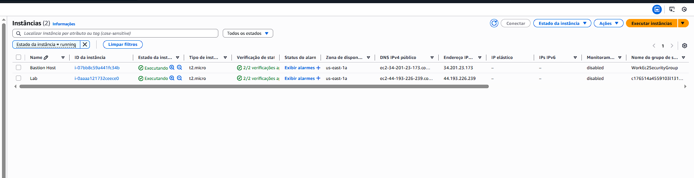
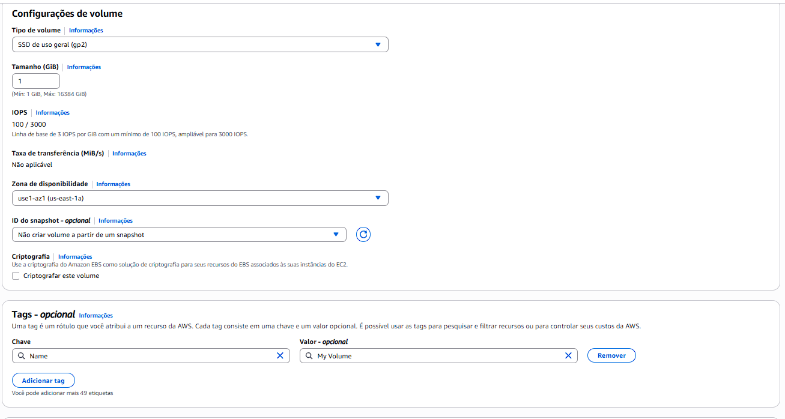
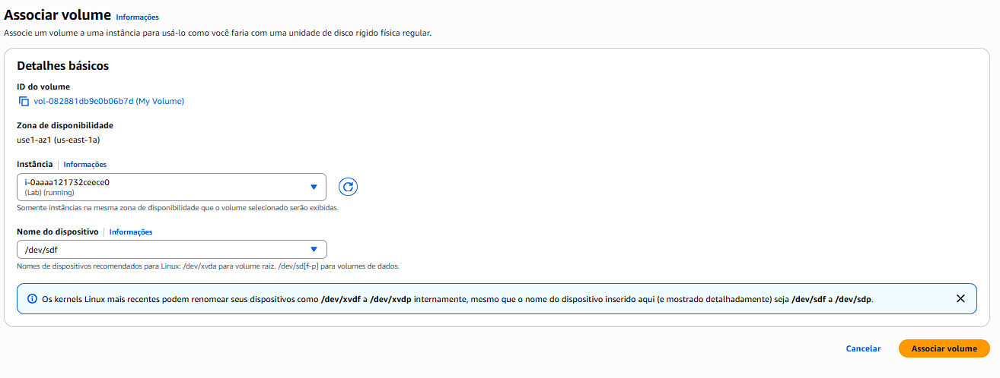
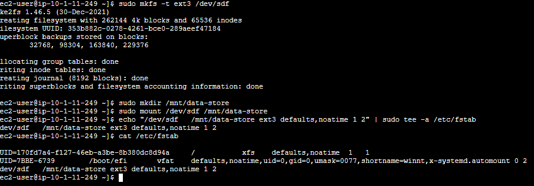
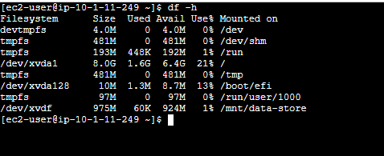

# Trabalhando com Amazon EBS  

## 📘 Visão Geral  
Este laboratório tem como foco o **Amazon Elastic Block Store (Amazon EBS)**, o serviço de armazenamento em blocos utilizado pelas instâncias **Amazon EC2**.  
Nele, foi possível criar volumes, anexá-los a instâncias, formatá-los, montar sistemas de arquivos e criar/restaurar snapshots.

---

## 🎯 Objetivos do Laboratório  
Ao concluir este laboratório, foi possível:

- Criar um volume Amazon EBS  
- Anexar e montar o volume em uma instância EC2  
- Criar um snapshot do volume  
- Criar um novo volume a partir do snapshot  
- Associar e montar o volume restaurado  
- Validar a restauração dos dados

-

---

## 🏗️ Instâncias

Este projeto utiliza duas instâncias EC2:

- **Lab**: instância principal onde são realizadas as operações de criação de volumes, montagem, snapshots e restauração.
- **Bastion Host**: instância utilizada como ponto seguro de acesso à rede privada da AWS, permitindo conectar-se a outras instâncias que não possuem acesso público.

---

## 📝 Criar um novo volume EBS

Para este projeto, foi criado um volume EBS com as seguintes configurações:

- **Tipo:** `gp2`  
- **Tamanho:** `1 GiB`  
- **Zona de disponibilidade:** a mesma utilizada pela instância `Lab`  
- **Tag:** `Name = My Volume`

--- 

## 🔗 Associação de volume

O volume foi associado à instância utilizando as seguintes definições:

- **Instância:** `Lab`  
- **Nome do dispositivo:** `/dev/sdf`  

---
## 🧰 Criação de volume

Foram executados os seguintes comandos para criação e configuração do volume:

- **Criar sistema de arquivos:**  
  `sudo mkfs -t ext3 /dev/sdf`  
  Cria o sistema de arquivos EXT3 no volume.

- **Criar diretório de montagem:**  
  `sudo mkdir /mnt/data-store`  
  Cria o diretório onde o volume será montado.

- **Montar o volume:**  
  `sudo mount /dev/sdf /mnt/data-store`  
  Monta o volume no diretório criado.

- **Adicionar montagem automática:**  
  `echo "/dev/sdf   /mnt/data-store ext3 defaults,noatime 1 2" | sudo tee -a /etc/fstab`  
  Garante que o volume será montado automaticamente após reinicialização.

---

## 📊 Resultado da criação

Após a configuração, foi utilizado o comando:

- `df -h`  
  Confirma a criação e mostra o volume disponível pelo sistema.

O dispositivo aparece como:

- **/dev/xvdf**

